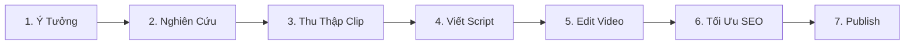
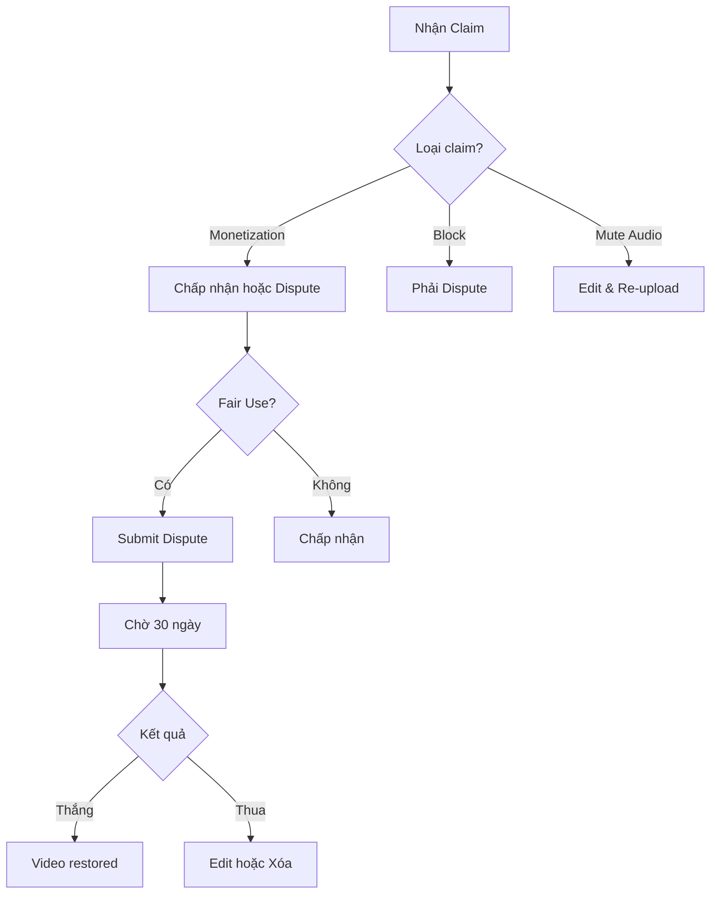

# 🤖 AI-Powered Workflow: Film & Animation YouTube Channel

> **Mục tiêu**: Tự động hóa tối đa quy trình làm video với AI, đồng thời tuân thủ đầy đủ quy định YouTube.

---

## ⚖️ QUY ĐỊNH YOUTUBE CẦN NẮM VỮNG

### 1. Fair Use (Sử Dụng Hợp Lý)
YouTube đánh giá Fair Use dựa trên **4 yếu tố**:

| Yếu tố | Yêu cầu | Cách áp dụng |
|--------|---------|--------------|
| **Mục đích sử dụng** | Phải "transformative" (biến đổi) | Thêm commentary, phân tích, phê bình |
| **Bản chất nội dung gốc** | Creative works rủi ro hơn | Cẩn thận với phim bom tấn |
| **Số lượng sử dụng** | Càng ít càng tốt | Clips < 30 giây, không liên tục |
| **Ảnh hưởng thị trường** | Không thay thế được original | Video của bạn ≠ xem phim miễn phí |

### 2. Content ID System
- YouTube tự động quét audio/video để phát hiện bản quyền
- **Nếu bị claim**: Video có thể bị block, mute, hoặc demonetize
- **Giải pháp**: Dispute nếu đúng Fair Use, hoặc edit lại video

### 3. Nguyên Tắc An Toàn
> [!IMPORTANT]
> **Luôn tuân thủ 3 quy tắc vàng:**
> 1. Clip < 30 giây liên tục
> 2. Thêm text overlay/commentary liên tục
> 3. Không để nguyên audio gốc quá lâu

---

## 🔄 WORKFLOW LIỀN MẠCH (7 BƯỚC)



---

## 📋 CHI TIẾT TỪNG BƯỚC + CÔNG CỤ AI

### BƯỚC 1: Tìm Ý Tưởng (10 phút)

| Công cụ AI | Mục đích | Cách dùng |
|------------|----------|-----------|
| **ChatGPT / Claude** | Brainstorm ideas | "Cho tôi 10 ý tưởng video về [Friends] cho YouTube Shorts" |
| **VidIQ** | Xem trending topics | Phân tích từ khóa hot trong niche |
| **TubeBuddy** | Competitor analysis | Xem video nào đang viral |

**Prompt mẫu cho AI:**
```
Bạn là chuyên gia YouTube trong lĩnh vực Film & Animation.
Cho tôi 5 ý tưởng video Shorts về series "The Office" với:
- Hook gây tò mò
- Độ dài phù hợp (30-60s)
- Góc nhìn mới lạ (không chỉ là clip thường)
```

---

### BƯỚC 2: Nghiên Cứu & Kiểm Tra Bản Quyền (5 phút)

| Công cụ | Mục đích |
|---------|----------|
| **YouTube Search** | Xem đã có ai làm video tương tự chưa |
| **Google** | Kiểm tra phim có aggressive copyright không |
| **ChatGPT** | Hỏi về lịch sử bản quyền của studio |

**Prompt mẫu:**
```
Studio [Warner Bros] có thường claim video reaction/clip trên YouTube không?
Phim [The Matrix] có an toàn để làm content Fair Use không?
```

**Danh sách Studio AN TOÀN hơn:**
- NBC Universal (The Office, Parks and Rec) ✅
- Netflix Originals (thường không claim mạnh) ✅
- Phim cũ (> 20 năm) ✅

**Danh sách Studio CẦN CẨN THẬN:**
- Disney/Marvel ⚠️
- Warner Bros ⚠️
- Sony Pictures ⚠️

---

### BƯỚC 3: Thu Thập Clip (15 phút)

| Công cụ | Mục đích | Lưu ý |
|---------|----------|-------|
| **OBS Studio** | Quay màn hình | Chỉ quay đoạn cần thiết |
| **yt-dlp** | Download từ YouTube | Chỉ dùng cho reference |
| **Screen recording** | Quay từ streaming | Chất lượng thấp hơn |

**Quy tắc thu thập:**
- [ ] Chỉ lấy đoạn 20-30 giây
- [ ] Không lấy cảnh action dài liên tục
- [ ] Ưu tiên dialogue scenes (dễ thêm commentary)

---

### BƯỚC 4: Viết Script với AI (10 phút)

| Công cụ AI | Mục đích |
|------------|----------|
| **ChatGPT / Claude** | Viết script commentary |
| **Gemini** | Phân tích scene |

**Prompt Template:**
```
Tôi đang làm video YouTube Shorts về scene trong phim [TÊN PHIM].
Scene: [MÔ TẢ NGẮN GỌN]

Hãy viết cho tôi:
1. Hook 3 giây đầu (gây tò mò)
2. Commentary 20 giây (phân tích scene)
3. Call-to-action cuối

Giọng văn: Hài hước, Gen Z, có emoji
Ngôn ngữ: Tiếng Anh (cho US audience)
```

**Output mẫu:**
```
HOOK: "This scene broke the entire cast and they left it in..."

COMMENTARY: "So what makes this moment so genius is that 
Jim's reaction wasn't scripted. Rainn Wilson genuinely 
surprised everyone, and if you look closely, you can see 
John Krasinski trying SO hard not to laugh..."

CTA: "Follow for more Office secrets you missed 👀"
```

---

### BƯỚC 5: Edit Video với AI (20 phút)

| Công cụ | Mục đích | AI Feature |
|---------|----------|------------|
| **CapCut** | Edit chính | Auto-caption, effects |
| **Descript** | Edit by transcript | AI voice, filler removal |
| **Opus Clip** | Cắt clip dài → Shorts | Auto-detect highlights |
| **Canva** | Thumbnail | AI background removal |

**Quy trình CapCut:**
1. Import clip gốc
2. **Auto Captions** → Tạo caption tự động
3. Chỉnh font: **Montserrat Bold**, màu trắng, viền đen
4. Thêm **Sound Effects** từ library (không dùng music copyright)
5. Thêm **Zoom effects** vào reaction faces
6. Export: 1080x1920, 30fps

**Checklist Copyright-Safe:**
- [ ] Thời lượng mỗi clip gốc < 30s liên tục
- [ ] Có text overlay suốt video
- [ ] Background music từ thư viện miễn phí
- [ ] Không để original audio > 50% video

---

### BƯỚC 6: Tối Ưu SEO với AI (5 phút)

| Công cụ AI | Mục đích |
|------------|----------|
| **ChatGPT** | Viết Title + Description |
| **VidIQ** | Keyword research |
| **TubeBuddy** | Tag suggestions |

**Prompt Template:**
```
Viết cho tôi YouTube Shorts metadata:
- Video về: [MÔ TẢ VIDEO]
- Target audience: US, 18-35 tuổi
- Tone: Entertaining

Cần:
1. Title (< 50 ký tự, có emoji)
2. Description (2-3 dòng + hashtags)
3. 10 tags
```

**Output mẫu:**
```
TITLE: This Office Scene Wasn't Scripted 😂

DESCRIPTION:
Rainn Wilson broke character and they kept it in! 
The Office has so many hidden gems like this...
#theoffice #comedy #shorts #dwight #behindthescenes

TAGS:
the office, dwight schrute, office bloopers, 
rainn wilson, jim halpert, nbc comedy, 
office scenes, wasn't scripted, behind the scenes, funny moments
```

---

### BƯỚC 7: Publish & Schedule (5 phút)

| Công cụ | Mục đích |
|---------|----------|
| **YouTube Studio** | Upload + Schedule |
| **Later / Hootsuite** | Cross-post social |

**Best Times to Post (US Audience):**
| Ngày | Giờ US (EST) | Giờ VN |
|------|--------------|--------|
| T2-T5 | 12:00 PM | 12:00 AM (nửa đêm) |
| T6 | 3:00 PM | 3:00 AM |
| T7-CN | 9:00 AM | 9:00 PM tối thứ 7 |

---

## 🚨 XỬ LÝ COPYRIGHT CLAIM

### Nếu bị Content ID Claim:



**Dispute Template:**
```
This video constitutes fair use under Section 107 of the 
Copyright Act. It is transformative in nature as it 
provides critical commentary and analysis of the original 
content. Only brief clips are used (under 30 seconds each) 
with substantial original commentary added throughout. 
This video does not substitute the original work and 
serves a different purpose (educational/commentary).
```

---

## ✅ CHECKLIST HÀNG NGÀY

- [ ] Tìm 1-2 ý tưởng mới (AI brainstorm)
- [ ] Kiểm tra bản quyền studio
- [ ] Thu thập clips (< 30s mỗi đoạn)
- [ ] Viết script với AI
- [ ] Edit trong CapCut (thêm captions + effects)
- [ ] Tối ưu SEO với AI
- [ ] Schedule đăng vào giờ peak US

---

## 📊 KPIs THEO DÕI

| Metric | Mục tiêu Tuần 1-4 | Mục tiêu Tháng 2-3 |
|--------|-------------------|---------------------|
| Videos/tuần | 7 | 7-14 |
| Avg Views | 1K | 10K |
| CTR | > 4% | > 6% |
| Watch time | > 50% | > 60% |
| Copyright claims | 0 | 0 |
